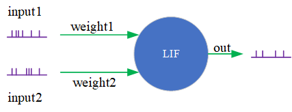
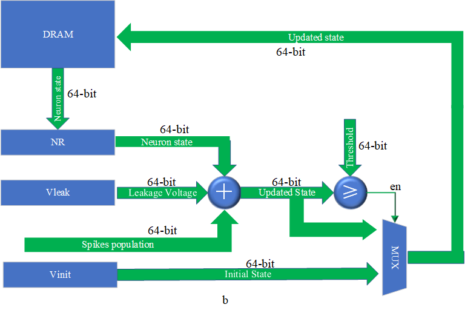
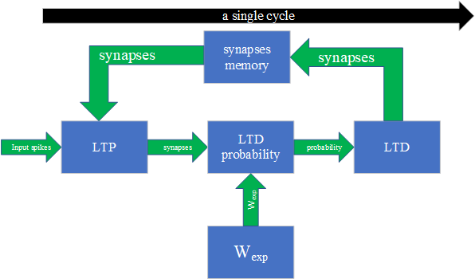
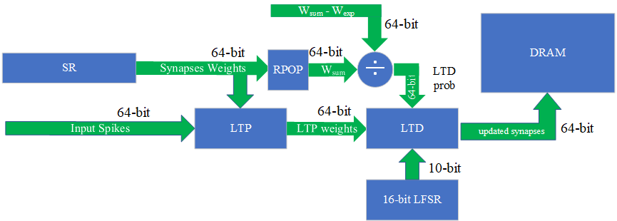
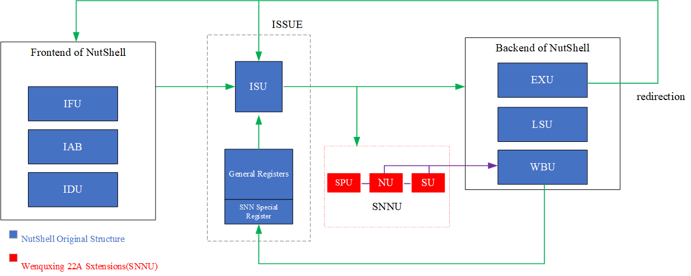

# Wenquxing 22A: A Low-power Neuromorphic Processor of RISC-V Customized Instruction Extensions for Spiking Neuron Network (RV-SNN), treamlined LIF model ,and Binary Stochastic STDP

## Contents

0. [Introduction](#0-introduction)
1. [RV-SNN Instruction Extensions](#1-rv-snn-instruction-extensions)
2. [Pruned LIF model and Binary synaptic weights](#2-pruned-lif-model-and-binary-synaptic-weights)
3. [Architecture](#3-architecture)
4. [Simulation and FPGA Implement Tips](#4-simulation-and-fpga-implement-tips)
5. [Revision History](#5-rivision-history)

## [0. Introduction](#contents)

Wenquxing 22A is a low-power neuromorphic processor which combines both general-purpose CPU functions and SNN to efficiently computing it with RISC-V SNN extension instructions. Its key features are shown as follow:

- The customized SNN extension instruction set in high computational granularity based on RISC-V ISA achieves the combination of a general-purpose processor and a SNN accelerator;
- Streamlined LIF model reduces the difficulty of computing and integrating the neuron model in our processor implementation;
- with the Binary Stochastic STDP to gear to the
single cycle updating of synaptic weights.

Since 32 general-purpose registers defined by RISC-V cannot meet the demand of SNN computing, we additionally design the SNN specifical registers in our processor. the following table describe each register:

|Name  |Bit address   |Description |
|------|--------------|------------|
|vinit |init_state<63:1>, STDP_on<0:0>|“vinit” register records the initial setting of SNN computing|
|nr    |neuron_state<63:1>, spike<0:0>|“nr” keeps neuron state loaded from external memory|
|sr    |synaptic_weights<63:0>| "sr" keeps binary synaptic weights loaded from external memory|
|output|spikes<63:0>| “output” register contains the output spikes from the same SNN layer|
|vleak |Vleak<63:0>|“vleak” register stores the leaky voltage|

## 1. RV-SNN Instruction Extensions

The full encoding definition of RV-SNN Extensions are in the following table:

|Catagory|Name|Function|Encoding|
|--------|----|--------|--------|
|Neuron  |VLEAK|setting leakage voltage|0000100_00000_?????_001_?????_0001011|
||NADD|add previous+valid-leaky  |0000000_?????_?????_010_?????_0001011|
||SGE|state greater or equal|0000000_?????_?????_100_?????_0001011|
||SLS|output left shift|0000001_00000_?????_001_?????_0001011|
||
|Synapse|SUP|synapses update/ LTP|0000011_?????_?????_001_?????_0001011|
||LTD|LTD process|0000000_?????_?????_110_?????_0001011|
||
|Other|ANDS|spikes bitwise AND|0000000_?????_?????_000_?????_0001011|
||RPOP|count spike population|0000000_00000_?????_001_?????_0001011|
||NLD|load neurons/synapses|????????????_?????_101_?????_0001011|
||NST|store neurons/synapses|???????_?????_?????_011_?????_0001011|
||INF|load supervisor|0000010_00000_?????_001_?????_0001011|
||SINIT|initialize SNN |????????????????_?_111_?????_0001011|

The detailed operation of RV-SNN is descriped in [section 2.1](#21-pruned-lif-model), [section 2.2](#22-binary-synaptic-weights).

## [2. Pruned LIF model and Binary synaptic weights](#contents)

### 2.1 Pruned LIF model

||
|:-:|
| *Fig 1. A LIF Model with Multi-input.*|

Leaky Integrate-and-Fire (LIF) model can be mathematically expressed as:

$$\tau \frac{dv}{dt} = v_0 - v + I $$

where 𝑣 and 𝐼 are the membrane potential and the input spike current respectively. In every update cycle, if 𝑣 is greater than the threshold, the neuron will fire and return its membrane potential to 𝑣0.

In order to integrate the LIF model into our pipeline, we simplify the calculation of updating neuron state as a pruned model which can be mathematically described as below:

$$S_{current} = S_{previous} + V_{valid} - V_{leakage}$$

where $𝑆_{𝑝𝑟𝑒𝑣𝑖𝑜𝑢𝑠}$ is the previous state of this neuron and $𝑉_{𝑣𝑎𝑙𝑖𝑑}$ is the input voltage computed by spikes processing. The value $𝑉_{𝑙𝑒𝑎𝑘𝑦}$ is representing the leakage voltage from the LIF model.

In hardware, this model is integrated into the **The Streamlined LIF Neuron Unit** shown below:

||
|:-:|
|*FIg 2. The Structure of the Streamlined LIF Neuron Unit.*|

In this unit, the `NADD`, `SLS` and `SGE` instructions will be executed afterward. After LSU (Load and Store Unit) using `NLD` reads the previous neuron state, the neuron unit begins to update the current neuron state stored by `NST`. 

### 2.2 Binary Synaptic Weights

We utilize a hardware-friendly and energy-efficient method which is the binary synaptic weights to implement the synapse model. The limited weights in this method may cause a drop in accuracy. We avoid it by using the efficient STDP learning rule, which used in this work is the Binary Stochastic STDP (BS-STDP). 

||
|:-:|
|*Fig 3. The process of single cycle binary stochastic STDP learning rule.*|

The fully process of Synapse Update is shown above.It is an order-based STDP that contains 2 stages, LTP and LTD. The LTP process is enabled first. This process will preserve synapses (set the synaptic weight to “1”)
that transmit and contribute to neuron firing. This process helps synaptic training avoid overlearning. Synapses of the current neuron are depressed with a probability, called LTD probability, which is normalized with the following formula:

$$P_{LTD} = 1024 \times \frac{\Delta w}{w_{sum}} \\
\Delta w = w_{sum} - w_{exp}
$$

where $w_{sum}$ is the number of actual active synapses and $\Delta w$ is the difference between the number of actual active synapses and the number of expected active synapses ($w_{exp}$). If $\frac{\Delta w}{w_{sum}}$ ≤ 0, this probability will be directly set to “0”. 

In hardware, the BS-STDP is integrated into the STDP Unit:

||
|:-:|
|*Fig 4. The Structure of the binary Synaptic Weights Unit.*|

In this unit, the `SUP` instruction updates the synapses depending on the input spikes sequence and the output spike in output register duing LTP process. Then in the LTD part, a 16-bit LFSR generates a 10 (out of 16) bits stochastic number to compare with this probability (instruction `LTD`).  The binary synaptic unit also handles `VINIT` and `VLEAK` instructions to set “vinit” register and “vleak” register.

## 3. Architecture

The following figure shows the overall micro-architecture of Wenquxing 22A. The SNN Unit (shown as SNNU) is added to the pipeline, which is at the execution stage.

||
|:-:|
|*fig 5. Overall Architecture of Wenquxing 22A (Baseline: NutShell).*|

Three stages in SNN workflow are handled by SPU (Spiking Process Unit), NU (Neuron Unit), and SU (Synapse Unit). All these components are integrated into SNNU. 

## 4. Simulation and FPGA Implement Tips

When simulate Wenquxing 22A or implement it on the FPGA platform, care should be taken with the following tips:

- To generate a emulator to simulate Wenquxing 22A, one should follow the instructions of [Nutshell](./README.md) where the README descripes detailed dependencies and operations how to use provided image or other images.
- To test the RV-SNN, we provide the [SNN-AM](https://github.com/JiulongWang/snn-am) which consists a headfile using Inline assembly to call the RV-SNN.
- For FPGA, [here](https://github.com/ssdfghhhhhhh/NutShell_U250) is a vivado project using U250 platform. To use this project, one should replace the top Verilog file in `/build/` folder with the verilog file generated by the chisel code of Wenquing 22A.  

## 5. Revision History

|Name|Version|Time|
|:-:| :--:|:--:|
|Wang jiulong| 1.0 verison| 2022.09.24|
